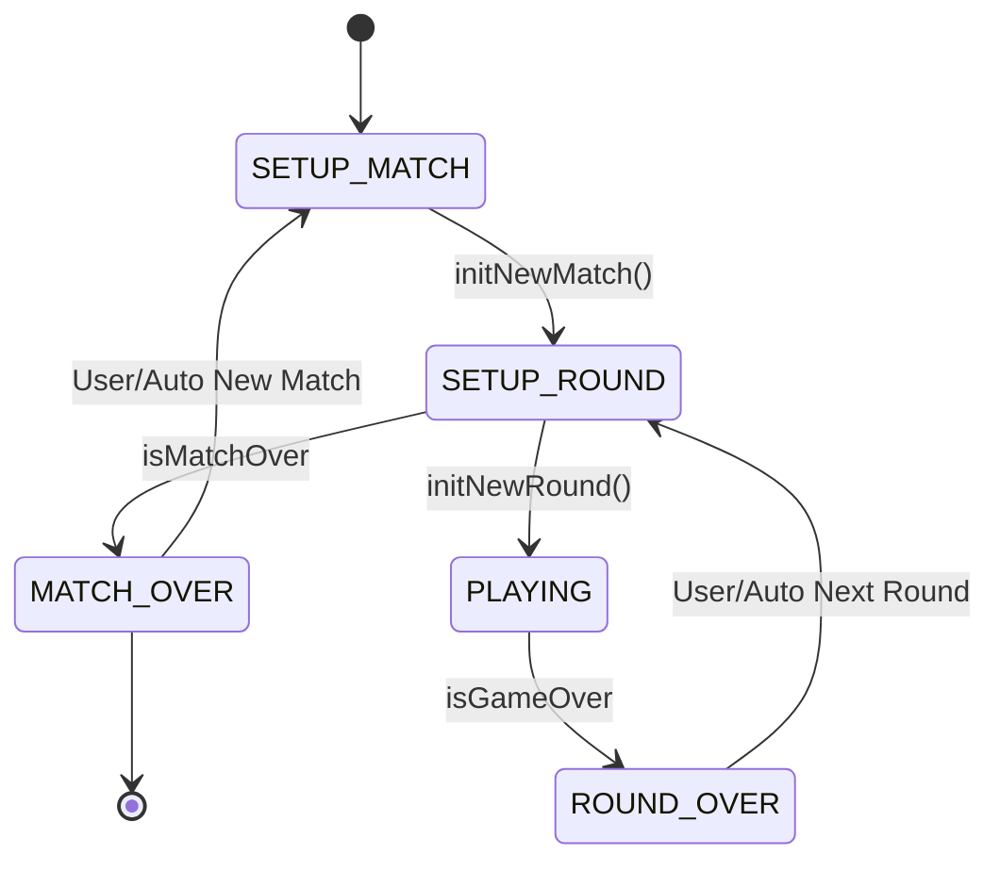

## State Descriptions

### PLAYING
The active gameplay state where players alternate turns making moves on the board.

**Behavior:**
- Players alternate between X and O turns
- If current player is CPU:
  - AI delays for `CPU_MOVE_DELAY_MS` (200ms)
  - Picks optimal move using `pickNextMoveOnBoardForPlayer()`
  - Applies move automatically
- If current player is human:
  - User clicks on empty tile to make move
  - Move is validated (must be empty tile and PLAYING state)
  - Move is applied via `applyMove(pickedTile, currentTurn)`
- Each move switches turn to other player
- Continues until game is over (win, draw, or board full)

**Exit condition:**
- Transitions to `ROUND_OVER` when `isGameOver` becomes true
